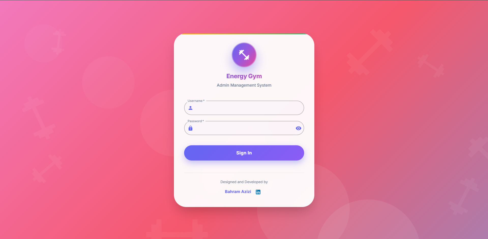
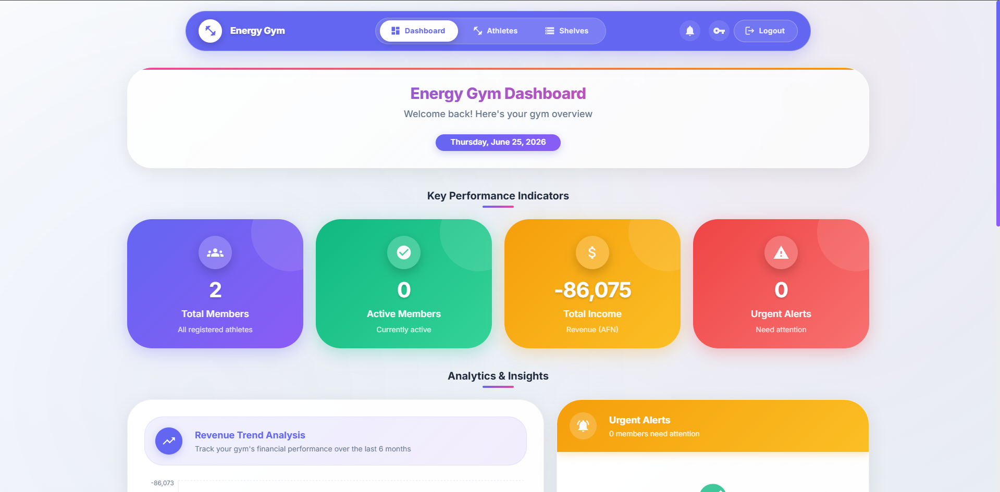
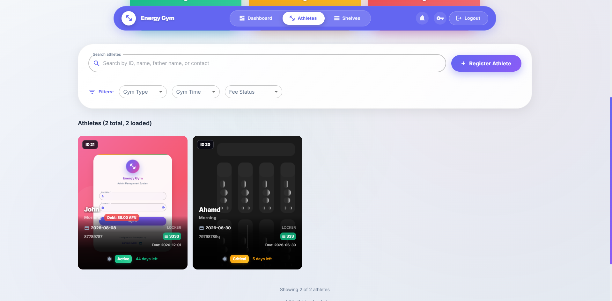
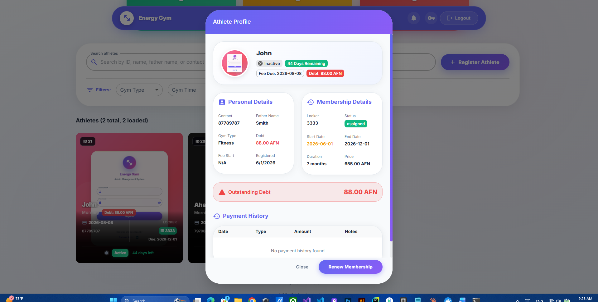
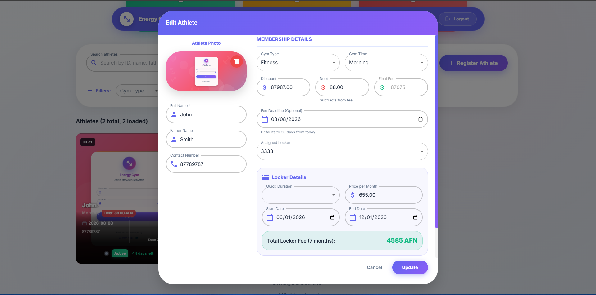
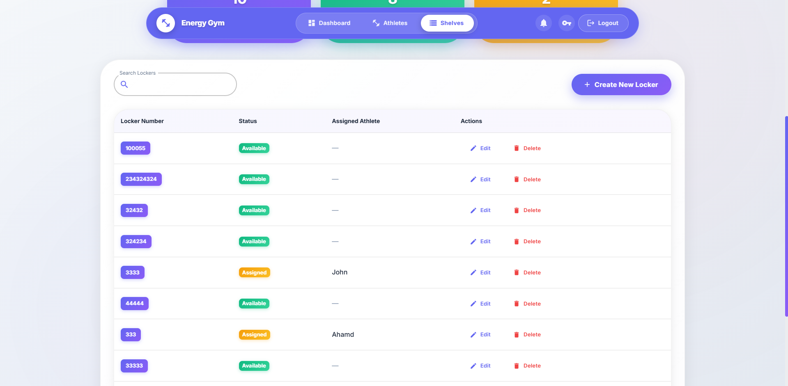
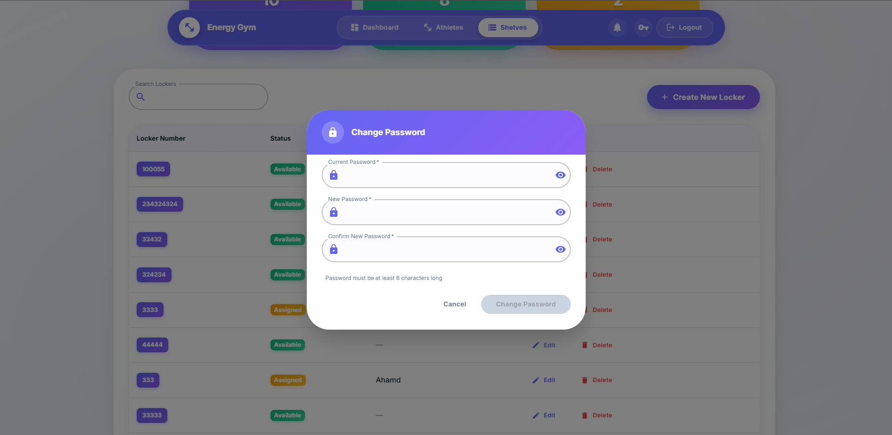

<div align="center">

# Gym Management System (MIS)

[](https://github.com/azizibahram/energy_gym_mis/actions/workflows/ci.yml)
[](https://gym-management-system-euf4.onrender.com)
[](https://react.dev/)
[](https://www.typescriptlang.org/)
[](https://www.djangoproject.com/)
[](https://mui.com/)
[](LICENSE)

<p align="center">
  
  
  
  
</p>

**A comprehensive Management Information System designed for modern gym operations**

<p align="center">
  <a href="#-features">Features</a> •
  <a href="#-demo">Demo</a> •
  <a href="#-screenshots">Screenshots</a> •
  <a href="#-installation">Installation</a> •
  <a href="#-api-reference">API</a>
</p>

</div>

---

## 🖼️ Screenshots

<div align="center">

### Demo Walkthrough


### Login & Dashboard



### Athlete Management




### Locker Management


### Account


</div>

---

## 📋 Overview

Energy Gym Management System is a full-stack web application that streamlines gym operations through an intuitive, modern interface. Built with **React + TypeScript** frontend and **Django REST API** backend, it provides comprehensive tools for athlete management, fee tracking, and locker assignment with real-time analytics and automated notifications.

### ✨ Key Features

| Feature | Description |
|---------|-------------|
| 📊 **Dashboard** | Real-time statistics with interactive charts, revenue trends, and automated alerts |
| 👥 **Athlete Management** | Complete CRUD operations with photo upload, profile management, and payment history |
| 🗄️ **Locker Management** | Efficient locker assignment system with availability tracking |
| 💰 **Fee Tracking** | Automated fee calculation, deadline monitoring with color-coded urgency indicators |
| 🔐 **Secure Auth** | JWT-based authentication with password change functionality |
| 📱 **Responsive UI** | Modern glass-morphism design with smooth animations and mobile support |

---

## 🛠️ Technology Stack

### Backend
<p align="left">
  <a href="https://www.djangoproject.com/"></a>
  <a href="https://www.django-rest-framework.org/"></a>
  <a href="https://jwt.io/"></a>
  <a href="https://www.sqlite.org/"></a>
  <a href="https://python-pillow.org/"></a>
</p>

### Frontend
<p align="left">
  <a href="https://react.dev/"></a>
  <a href="https://www.typescriptlang.org/"></a>
  <a href="https://mui.com/"></a>
  <a href="https://recharts.org/"></a>
  <a href="https://axios-http.com/"></a>
  <a href="https://reactrouter.com/"></a>
  <a href="https://vitejs.dev/"></a>
</p>

---

## 🎮 Demo

🚀 **Live**: [gym-management-system-euf4.onrender.com](https://gym-management-system-euf4.onrender.com)

You can also run the project locally or with Docker:

### Docker (one command)
```bash
docker compose up
```
Then open http://localhost:8000.

### Manual Setup
See installation instructions below.

---

## 🐳 Docker

```bash
# Build and start
docker compose up --build

# Run migrations
docker compose exec web python manage.py migrate

# Create admin user
docker compose exec web python manage.py createsuperuser
```

---

## 🚀 Installation

### Prerequisites
-  Python 3.8 or higher
-  Node.js 16 or higher
-  Git

### ⚡ Quick Start (Windows)

Run the automated startup script:
```bash
start_servers.bat
```

This will start both backend and frontend servers simultaneously.

### 🔧 Manual Setup

> **First time?** Copy `.env.example` to `.env` and adjust values:
> ```bash
> cp .env.example .env   # macOS/Linux
> copy .env.example .env  # Windows
> ```

#### Backend Setup

```bash
# Navigate to backend directory
cd backend

# Create virtual environment
python -m venv .venv
.venv\Scripts\activate  # Windows
source .venv/bin/activate  # macOS/Linux

# Install dependencies
pip install -r requirements.txt

# Run migrations
python manage.py makemigrations
python manage.py migrate

# Create superuser
python manage.py createsuperuser

# Start server
python manage.py runserver
```

#### Frontend Setup

```bash
# Navigate to frontend directory
cd frontend

# Install dependencies
npm install

# Start development server
npm run dev
```

---

## 📖 Usage Guide

1. **Access the Application**: Open your browser at `http://localhost:5173`
2. **Login**: Authenticate with your admin credentials
3. **Dashboard**: View real-time statistics, revenue charts, and urgent alerts
4. **Manage Athletes**: Register new members, track payments, assign lockers
5. **Locker Management**: Monitor locker availability and assignments
6. **Account Settings**: Change password via the key icon in the navbar

---

## 🔌 API Reference

| Method | Endpoint | Description |
|--------|----------|-------------|
| `POST` | `/api/token/` | Authenticate and obtain JWT tokens |
| `GET` | `/api/dashboard/` | Retrieve dashboard statistics |
| `GET/POST` | `/api/athletes/` | List or create athletes |
| `PUT/DELETE` | `/api/athletes/{id}/` | Update or delete athlete |
| `GET/POST` | `/api/shelves/` | List or create lockers |
| `PUT/DELETE` | `/api/shelves/{id}/` | Update or delete locker |
| `POST` | `/api/athletes/{id}/renew/` | Renew membership |
| `POST` | `/api/athletes/{id}/toggle_status/` | Activate/deactivate athlete |
| `POST` | `/api/change-password/` | Update admin password |

---

## 📁 Project Structure

```
EnergyGymSystem/
├── 📂 backend/                    # Django REST API
│   ├── 📂 gymsystem/              # Project configuration
│   │   ├── settings.py
│   │   ├── urls.py
│   │   └── wsgi.py
│   ├── 📂 gym/                    # Main application
│   │   ├── models.py
│   │   ├── views.py
│   │   ├── serializers.py
│   │   └── migrations/
│   ├── manage.py
│   └── requirements.txt
│
├── 📂 frontend/                   # React Application
│   ├── 📂 src/
│   │   ├── 📂 components/         # React components
│   │   │   ├── Dashboard.tsx
│   │   │   ├── Athletes.tsx
│   │   │   ├── Shelves.tsx
│   │   │   ├── Login.tsx
│   │   │   └── Layout.tsx
│   │   ├── 📂 context/            # React contexts
│   │   ├── App.tsx
│   │   └── main.tsx
│   ├── package.json
│   └── vite.config.ts
│
├── start_servers.bat              # Windows startup script
└── README.md
```

---

## 🎨 UI/UX Features

- **Glass Morphism Design**: Modern frosted glass effects throughout the interface
- **Animated Transitions**: Smooth page transitions, hover effects, and micro-interactions
- **Gradient Themes**: Beautiful gradient color schemes on cards and buttons
- **Responsive Layout**: Fully responsive design for desktop, tablet, and mobile
- **Status Indicators**: Color-coded urgency system:
  - 🟢 **Active**: 16+ days remaining
  - 🔵 **Warning**: 6-15 days remaining
  - 🟠 **Critical**: 1-5 days remaining
  - 🔴 **Overdue**: Payment deadline passed

---

## 💼 Business Logic

| Category | Details |
|----------|---------|
| **Authentication** | Single administrator access |
| **Membership Fees** | Fitness: 1000 AFN / Bodybuilding: 700 AFN |
| **Payment Terms** | 30-day grace period from registration |
| **Locker System** | Exclusive assignment to registered athletes |

---

## 🤝 Contributing

Contributions are welcome! Please follow these steps:

1. 🍴 Fork the repository
2. 🌿 Create a feature branch (`git checkout -b feature/AmazingFeature`)
3. 💾 Commit your changes (`git commit -m 'Add some AmazingFeature'`)
4. 📤 Push to the branch (`git push origin feature/AmazingFeature`)
5. 🔍 Open a Pull Request

---

## 📄 License

Distributed under the **MIT License**. See [LICENSE](LICENSE) for more information.

---

## 👨‍💻 Developer

**Bahram Azizi**

[](https://www.linkedin.com/in/bahramazizi1996)

---

<div align="center">

**[⬆ Back to Top](#-energy-gym-management-system-mis)**

Made with ❤️ and ☕

</div>
